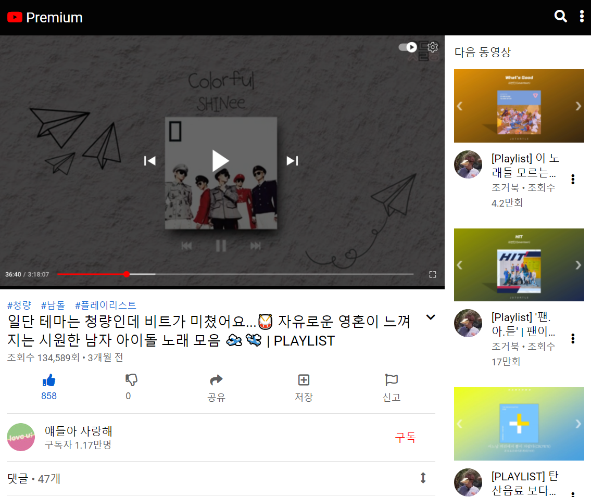
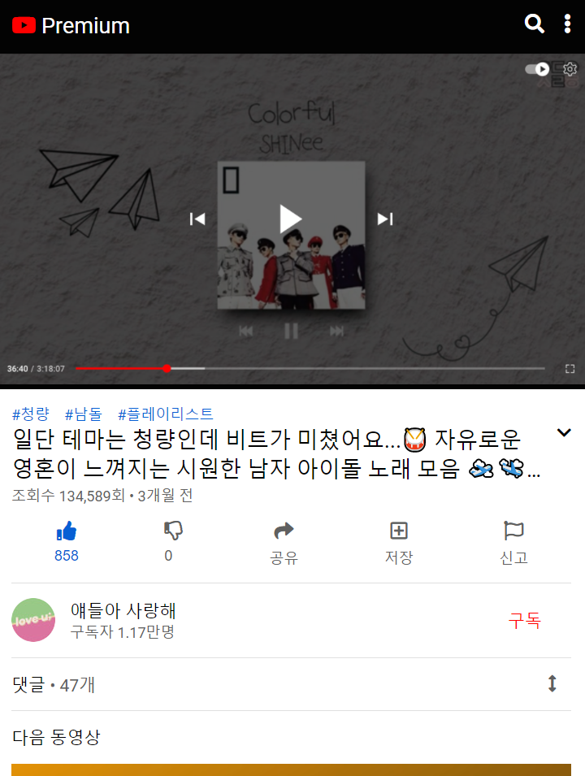
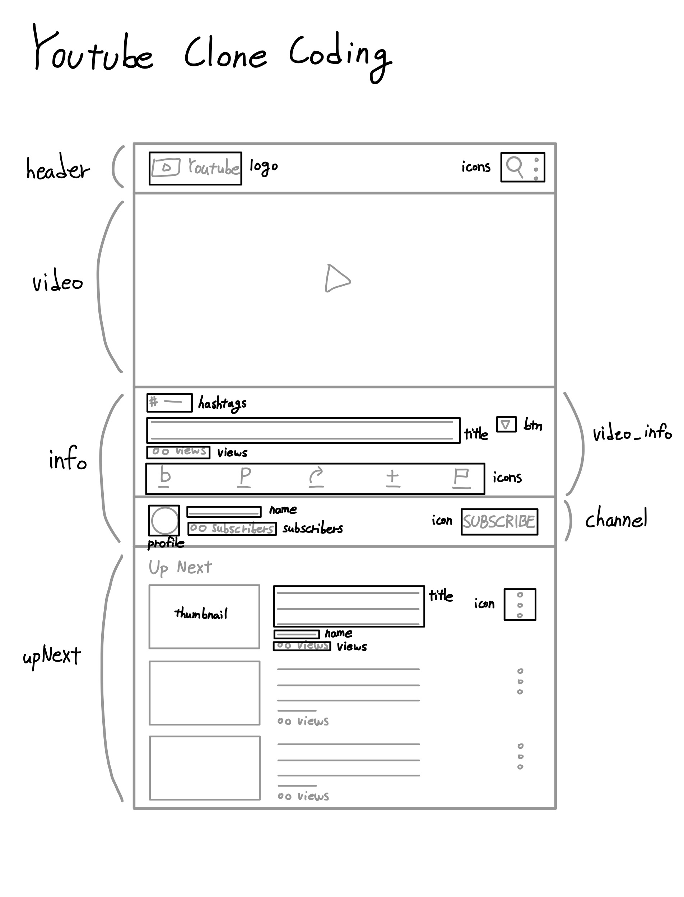
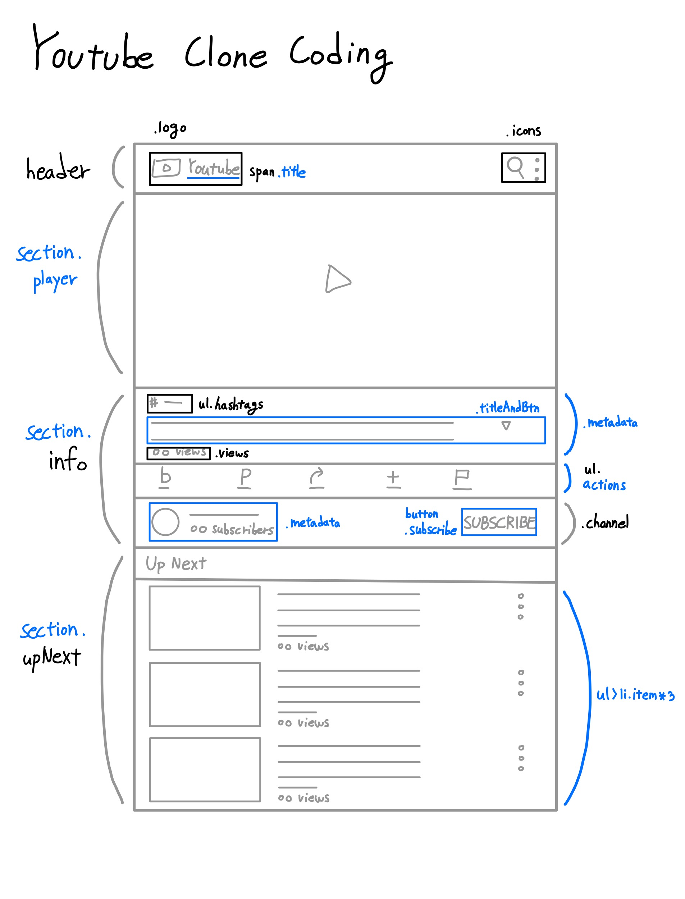

# YouTube Mobile Clone Coding
|||
|:-:|:-:|

## About
유튜브 모바일 버전에서 프론트엔드(반응형 UI)를 중심으로 클론 코딩한 프로젝트. (유튜브 영상은 이미지로 대체)

## Stack
HTML, CSS, Vanilla JavaScript

## Period
2021.8.20. ~ 2021.8.23.

## Roadmap
- [X] 와이어프레임 작성

|||
|:-:|:-:|
|수정 전|수정 후|

- [X] HTML 작성
- [X] CSS 스타일 적용
- [X] 아이콘 클릭 시 회전 애니메이션 활성화
- [X] 버튼 클릭 시 숨겨진 내용 표시 기능 추가

## Error
|Problem|Solution|
|:-|:-|
|유튜브 모바일 버전과 데스크탑 버전이 비슷할 거라고 생각하여 데스크탑 버전을 참고해서 코딩하다가, 마무리 단계에서 상당 부분이 다르다는 것을 알아차림.|클론 코딩은 결과물을 얼마나 유사하게 구현해 내는지가 가장 중요하다고 생각하는데, 제대로 확인도 하지 않은 채로 코딩 중에 직면한 문제. 와이어프레임 작성 단계부터 잘못되어 HTML을 재작성해서 해결.|
